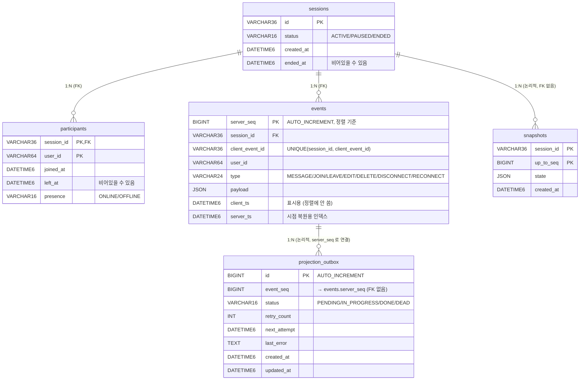

# Sokind Chat — 설계 문서 (통합본)

> 이 문서가 설계의 기준. 이전에 나뉘어 있던 문서들(`replay.md`, `failure.md`, `query.md`, `perf.md`, `erd.md`)을 모두 하나로 합쳤다.
>
> **읽는 법** — 위에서 아래로 한 번 읽거나, 아래 목차의 링크로 바로 이동. 코드 바뀌면 여기 한 곳만 고치면 된다.

---

## 목차

1. [한눈에 보기](#1-한눈에-보기)
2. [도메인 모델 + ERD](#2-도메인-모델--erd)
3. [핵심 흐름](#3-핵심-흐름)
4. [비동기 처리 (Hybrid Outbox)](#4-비동기-처리-hybrid-outbox)
5. [상태 복원 (Replay)](#5-상태-복원-replay)
6. [자주 쓰는 쿼리와 인덱스](#6-자주-쓰는-쿼리와-인덱스)
7. [재연결 · 중복 · 순서](#7-재연결--중복--순서)
8. [수평 확장 경로](#8-수평-확장-경로)
9. [관측 (모니터링)](#9-관측-모니터링)
10. [장애 시나리오 + 대응법](#10-장애-시나리오--대응법)
11. [성능 측정 (k6)](#11-성능-측정-k6)
12. [의도적으로 받아들인 단점](#12-의도적으로-받아들인-단점)

---

## 1. 한눈에 보기

**한 줄 요약** — 1:1 실시간 채팅 백엔드. `events` 테이블이 모든 진실의 원본(추가만 가능). 나머지 데이터는 events 를 다시 합쳐서 만들 수 있는 파생 결과.

**핵심 보장 4가지**

| 보장 | 방법 |
|---|---|
| 멱등성 (같은 요청을 여러 번 해도 결과가 같음) | `UNIQUE(session_id, client_event_id)` + `INSERT IGNORE` → 클라이언트 재시도 안전 |
| 결정성 (같은 입력이면 항상 같은 출력) | `server_seq` 순으로만 정렬 + 순수 함수로 합치기 → 같은 (sessionId, at) → 항상 같은 Timeline |
| 실시간성 | Hybrid Outbox — 트랜잭션 commit 직후 리스너가 바로 처리 → 캐시 지연 거의 0 |
| 견고성 | Outbox 테이블 + 지수 백오프 재시도 + 실패 격리(DEAD) + Prometheus 메트릭 |

**아키텍처 한눈에**

```
            [클라이언트]
                │
   ┌────────────┼────────────┐
   │ REST API   │  WebSocket │
   ▼            ▼            ▼
Controllers   ChatWebSocketHandler
   └─────┬──────┘
         ▼
EventIngestService.ingest()                ◀── @Transactional
   INSERT events                              (멱등 + 한 번에 처리)
   INSERT outbox (PENDING)
   publishEvent(OutboxAppended)
   COMMIT
         │
         ├─► ProjectionEventListener            (빠른 경로, 지연 ~0)
         │     @TransactionalEventListener(AFTER_COMMIT)
         │     @Async("projectionExecutor")
         │     → processBatch()
         │
         └─► (5초마다) ProjectionWorker.tick()  (따라잡기 경로)
               → processBatch()  (같은 메서드)

processBatch:
   participants 갱신 (캐시)
   publish(SnapshotRequested) → SnapshotEventListener (@Async)
                                  └→ snapshots 테이블 (N개 단위)
```

---

## 2. 도메인 모델 + ERD

### 2.1 5개 테이블의 의미

| 테이블 | 역할 | 진실의 원본? |
|---|---|---|
| `sessions` | 세션 정보 (상태, 시간) | ✓ |
| `participants` | 참여자 캐시 (접속 상태) | events 로부터 만들어진 파생 |
| `events` | 모든 도메인 이벤트 (추가만 가능) | **✓ 원본** |
| `projection_outbox` | 처리 대기 큐 (PENDING/IN_PROGRESS/DONE/DEAD) | 임시 큐 |
| `snapshots` | 시점별 합산 결과 (캐시) | events 로부터 만들어진 파생 |

### 2.2 ERD (Mermaid)



### 2.3 제약 / 인덱스

| 인덱스 | 테이블 | 컬럼 | 용도 |
|---|---|---|---|
| (PK) | sessions | id | 단건 조회 |
| (PK) | participants | (session_id, user_id) | 캐시 조회, 존재 여부 확인 |
| (PK) | events | server_seq | replay 정렬 기준 |
| `uk_events_dedup` | events | (session_id, client_event_id) | UNIQUE — 중복 방지를 DB 에 위임 |
| `idx_events_session_seq` | events | (session_id, server_seq) | timeline / WS 재접속 시 누락분 조회 |
| `idx_events_session_ts` | events | (session_id, server_ts) | 시점 복원 (`server_ts <= at`) |
| `idx_outbox_status_next` | projection_outbox | (status, next_attempt) | 워커 폴링 |
| (PK) | snapshots | (session_id, up_to_seq) | 스냅샷 가져오기 (DESC) |

### 2.4 설계 결정과 근거

- **`server_seq BIGINT AUTO_INCREMENT`** — 항상 증가. 서버 도착 순서로 정렬. 시계가 어긋나도 영향 없음
- **`(session_id, client_event_id) UNIQUE`** — 중복 검사를 DB 가 알아서. 앱 레벨에서 race 처리 안 해도 됨
- **UUID → `VARCHAR(36) CHARACTER SET ascii`** — `BINARY(16)` 보다 인덱스가 약 55% 크지만, MySQL CLI/GUI 에서 사람이 바로 읽을 수 있음. 운영 가시성 > 인덱스 크기. (V1__init_schema.sql 주석 참조)
- **`payload JSON`** — 이벤트 타입마다 형태가 달라서. 키 검색이 필요해지면 generated column + 인덱스로 보강
- **`DATETIME(6)`** — UTC 로 통일. `TIMESTAMP` 의 2038 문제와 세션 timezone 영향 회피
- **`projection_outbox.event_seq` / `snapshots.session_id` 에 FK 없음** — outbox 는 잠깐 살고 캐시는 지워질 수 있음. snapshots 도 파생이라 FK 두면 운영 유연성이 떨어짐

---

## 3. 핵심 흐름

### 3.1 이벤트 적재 (Ingest)

REST (`POST /sessions/{id}/events`) 와 WebSocket 메시지가 모두 `EventIngestService.ingest()` 로 모인다. 한 트랜잭션 안에서:

```sql
INSERT IGNORE INTO events (session_id, client_event_id, user_id, type, payload, client_ts) VALUES (?, ?, ?, ?, ?, ?);
-- 새 row 가 들어갔으면:
INSERT INTO projection_outbox (event_seq) VALUES (?);  -- PENDING 상태로 시작
-- ApplicationEventPublisher.publishEvent(OutboxAppended(outboxId, eventSeq, sessionId))
COMMIT
```

- 영향 받은 row 가 0 (중복) → 기존 `server_seq` 만 조회해서 `duplicate=true` 로 응답
- 새로 추가됨 → outbox row 까지 같은 트랜잭션으로 묶어 한 번에 처리
- commit 직후 리스너가 즉시 발화 (§4)

### 3.2 WebSocket 라이프사이클

엔드포인트: `ws://host/ws/chat?session={uuid}&user={id}[&since={lastSeq}]`

```
afterConnectionEstablished(ws):
  파라미터/세션 검증 (실패 → CloseStatus.BAD_DATA)
  PresenceTracker.attach() → firstForUser boolean
  since 있으면: EventRepository.findSince() 로 누락된 이벤트를 그 ws 에만 보냄 (replay:true)
  firstForUser=true 일 때만: RECONNECT 이벤트 적재 + 전체 전송

handleTextMessage(ws, json):
  JSON 파싱 (clientEventId / type / payload / clientTs)
  EventIngestService.ingest()
  broadcast(sessionId, envelope)  ← 같은 세션의 모든 ws 에 즉시 뿌림

afterConnectionClosed(ws):
  PresenceTracker.detach() → empty boolean
  empty=true 일 때만: DISCONNECT 이벤트 적재 + 전체 전송
```

**설계 원칙** — JOIN/LEAVE 는 **사용자가 직접 한 행동** (REST), RECONNECT/DISCONNECT 는 **연결 상태 변화** (WS). 한 사람이 탭 여러 개 열면 첫 탭 열 때만 RECONNECT 1번, 마지막 탭이 닫혀야 DISCONNECT 1번.

### 3.3 Timeline 결정적 재구성

`GET /sessions/{id}/timeline?at={ISO}` — `at` 시점의 세션 상태를 항상 같은 결과로 반환:

```json
{
  "at": "2026-05-15T03:32:04Z",
  "upToSeq": 20,
  "participants": [{"userId": "alice", "presence": "ONLINE"}, ...],
  "messages":     [{"seq": 13, "userId": "alice", "payload": {...}, "deleted": false, "editedAtSeq": null}, ...]
}
```

내부 동작은 §5 참조.

---

## 4. 비동기 처리 (Hybrid Outbox)

### 4.1 두 경로가 동시에 동작

```
[A: 빠른 경로 — 지연 ~0]
  ingest COMMIT
    └─ AFTER_COMMIT
       ProjectionEventListener (@Async projectionExecutor, proj-* 스레드)
         → projectionService.processBatch()

[B: 따라잡기 경로 — 5초 간격]
  ProjectionWorker.tick()  (scheduling-* 스레드)
    → projectionService.processBatch()

processBatch (두 경로 공통):
   pollPending(now, batch=50) ← PESSIMISTIC_WRITE
   각 outbox row 마다:
     event = EventRepository.findById(event_seq)
     applyToReadModel(event)              ← participants 갱신
     publishEvent(SnapshotRequested)      ← commit 후 SnapshotEventListener (@Async)
     markDone() | markFailure(지수 백오프, 5회 후 DEAD)
```

### 4.2 빠른 경로 vs 따라잡기 경로 비교

| 항목 | 빠른 경로 (AFTER_COMMIT) | 따라잡기 (5초 폴링) |
|---|---|---|
| 트리거 | `OutboxAppended` ApplicationEvent | `@Scheduled(fixedDelay=5s)` |
| 실행 스레드 | `projectionExecutor` (proj-*, core=2 max=4) | 스케줄러 스레드 |
| 캐시 지연 | ~0ms | 최대 5초 |
| 평소 부하 | ingest 1번당 리스너 1번 | 5초마다 SELECT 1번 (대부분 0건) |
| 동작 조건 | `projection.immediate=true` (기본값) | 항상 |
| 책임 | 즉시 반영 | 리스너 실패 / JVM 재시작 / DEAD 정리 |

### 4.3 멱등성 3중 보호

| 단계 | 방법 | 어떤 경쟁을 막나 |
|---|---|---|
| 1. 비관적 락 | `@Lock(PESSIMISTIC_WRITE)` | 두 워커가 같은 row 를 동시에 처리하는 것 |
| 2. status=PENDING 필터 | `pollPending` 의 WHERE 조건 | A 가 markDone 한 row 를 B 가 다시 봐도 자동 스킵 |
| 3. 연산 자체가 멱등 | `markOnline()` 두 번 = 한 번, JOIN 은 findById 후 upsert | 어떤 이유로든 두 번 적용돼도 결과 동일 |

→ 두 경로(빠른+따라잡기)가 같이 돌아도 안전. 3단계가 최후의 방어선.

### 4.4 재시도 / DLQ (실패 격리 큐)

```
실패 → markFailure(err, now + 2^retryCount 초, maxRetry=5)
  retryCount=0 → 1초 후 PENDING 복귀
  retryCount=1 → 2초 후
  retryCount=2 → 4초 후
  retryCount=3 → 8초 후
  retryCount=4 → 16초 후
  retryCount=5 → 32초 후
  retryCount > 5 → status=DEAD (더 이상 처리 안 함)
```

DLQ 보는 법: `sokind.outbox.dead` Prometheus gauge + SQL 한 줄:
```sql
SELECT * FROM projection_outbox WHERE status='DEAD';
```

### 4.5 왜 Hybrid 인가

예전엔 200ms 마다 폴링하는 단일 경로였다. 단순했지만:
- 캐시가 항상 ~100ms 늦음 (`GET /participants` 같은 즉시 조회와 경쟁)
- 트래픽 없을 때도 200ms 마다 락 쿼리 — 무의미한 DB 부하

Hybrid 는 두 약점을 같이 해결:
- **즉시성**: 빠른 경로는 in-process 이벤트라 지연 ~0
- **부하 감소**: 폴링 200ms → 5s = 빈 쿼리 빈도 **25배 감소**
- **견고함 유지**: 따라잡기 폴링이 리스너 실패·JVM 재시작·DEAD 재시도 케이스를 모두 처리
- **외부 의존성 0**: MySQL + Spring 이벤트만으로 구성

---

## 5. 상태 복원 (Replay)

### 5.1 합치기 (Fold) 규칙

`TimelineService.replay` 가 events 를 `server_seq` 순으로 합친다:

| 이벤트 타입 | participants 변화 | messages 변화 |
|---|---|---|
| JOIN | `presence=ONLINE` 으로 추가 | — |
| LEAVE | map 에서 **제거** | — |
| RECONNECT | 알고 있는 사람이면 `presence=ONLINE` | — |
| DISCONNECT | 알고 있는 사람이면 `presence=OFFLINE` | — |
| MESSAGE | — | `{seq, userId, payload, deleted:false, editedAtSeq:null}` 추가 |
| EDIT | — | 대상 메시지의 `payload` 를 `newPayload` 로 교체, `editedAtSeq=이 이벤트의 serverSeq` |
| DELETE | — | 대상의 `deleted=true` (payload 는 유지) |

### 5.2 결정성을 만드는 3가지

1. **입력이 항상 같음**: `SELECT * FROM events WHERE session_id=? AND server_ts <= at ORDER BY server_seq ASC`
2. **합치는 연산이 결정적**: server_seq 순서에만 의존, 현재 시각에 의존 안 함
3. **출력이 안정적**: 같은 (sessionId, at) → JSON 바이트 동일 (테스트로 확인)

### 5.3 Snapshot + Delta vs 전체 다시 합치기

`TimelineService.replay` 가 두 모드를 자동 선택:

```
1) at 시점의 기준 seq = max(server_seq WHERE server_ts <= at)
2) 기준 seq 이하 중 가장 최신 snapshot 조회
   ├─ snapshot 있음 → Snapshot+Delta 모드
   │    state → fold 초기값으로 로드
   │    delta = events WHERE server_seq > snap.upToSeq AND server_ts <= at
   │    snapshot 상태 위에 delta 만 fold
   │
   └─ snapshot 없음 → 전체 다시 합치기
        빈 상태에서 시작해 fold(events WHERE server_ts <= at)
```

두 경로 모두 같은 fold 함수 → 결과 결정성 동일.

스냅샷은 **합산 결과** 를 저장 (events 의 복사본이 아님). 없어져도 events 로부터 다시 만들 수 있는 캐시.

### 5.4 N개 단위(every-N) 결정 근거

`application.yml` 의 `snapshot.every-n`. 데모는 5, 운영 권장 50.

| 가정 | 값 |
|---|---|
| 1:1 세션 평균 이벤트 수 | 100~500 |
| timeline 호출 빈도 | 낮음 (사용자가 시점 복원 진입 시) |
| snapshot 1회 비용 | replay + JSON 직렬화 + INSERT ≈ 10ms |

**N=50 의 의미**
- 평균 200 event 세션 → snapshot 4개 — 저장 부하 무시 가능
- 시점 복원 시 평균 25 event 만 fold → 한 자릿수 ms
- N=10 까지 줄이면 더 빠르지만 snapshot 저장 비용이 ingest p95 의 ~5% 까지 차지 — 비효율
- N=500 (대용량 세션) → 평균 250 event fold 도 한 자릿수 ms 안

→ N=50 이 손익분기점 (시점 복원 비용 ↘ 과 snapshot 비용 ↗ 의 교차점이 30~70).

### 5.5 캐시 조회 vs 다시 합치기의 차이

같은 원본, 두 가지 사용자:

| 경로 | 신선도 | 비용 | 보여주는 것 |
|---|---|---|---|
| `GET /sessions/{id}/participants` | ~0ms (빠른 경로), 최대 5초 (따라잡기만) | O(참가자 수) 단건 SELECT | 떠난 사람 row 도 포함 (leftAt 채워서) |
| `GET /sessions/{id}/timeline?at=` | 즉시 (fold) | O(N events) 또는 snapshot+델타 | 그 시점에 "지금 참여 중"인 사람만 |

캐시가 틀리면 fold 가 진실. 캐시는 다시 만들 수 있음. 이 원칙이 시스템을 정직하게 유지한다.

---

## 6. 자주 쓰는 쿼리와 인덱스

### 6.1 Q1 — 멱등 이벤트 적재

```sql
INSERT IGNORE INTO events (session_id, client_event_id, user_id, type, payload, client_ts)
VALUES (?, ?, ?, ?, ?, ?);
-- 영향 row 가 0 이면:
SELECT server_seq FROM events WHERE session_id = ? AND client_event_id = ?;
```

**인덱스**: `uk_events_dedup (session_id, client_event_id)` — UNIQUE B-tree.
- Insert: 인덱스 탐색 + 삽입. 충돌은 인덱스에서 바로 감지
- 중복 SELECT: 인덱스 조회 1회. `server_seq` 가 PK 라 leaf 만 보고 답이 나옴

**측정 p95** (k6, §11): 신규 **14.04ms**, 중복 **11.69ms**

**병목 없음**: 1천만 row 가 쌓여도 O(log N). 잠재적 핫스팟은 PK auto-increment 락인데 `innodb_autoinc_lock_mode=2` 로 안 막힘.

### 6.2 Q2 — Timeline 전체 다시 합치기

```sql
SELECT * FROM events
 WHERE session_id = ? AND server_ts <= ?
 ORDER BY server_seq ASC;
```

**인덱스**:
- `idx_events_session_ts` — `<=` 범위 필터
- `idx_events_session_seq` — 정렬, filesort 회피

**측정 p95**: 21k 이벤트 단일 세션에서 **157.79ms** (전체). snapshot+delta 적용 후 한 자릿수 ms 기대.

### 6.3 Q3 — Outbox 폴링

```sql
SELECT * FROM projection_outbox
 WHERE status = 'PENDING' AND next_attempt <= NOW(6)
 ORDER BY id ASC
 LIMIT 50
 FOR UPDATE;     -- PESSIMISTIC_WRITE
```

**인덱스**: `idx_outbox_status_next (status, next_attempt)` — 필터 + PK 정렬

**락 모드**: 현재 코드는 `@Lock(LockModeType.PESSIMISTIC_WRITE)` + JPA hint `jakarta.persistence.lock.timeout = -2`. MySQL 8.0+ 에서 `-2` 는 SKIP LOCKED 로 번역되지만, 워커가 하나인 지금은 일반 `FOR UPDATE` 와 같음. 워커가 여러 개로 늘면 SKIP LOCKED 가 진가 발휘 → §8.

### 6.4 인덱스 한눈에 — §2.3 표 참조

### 6.5 일부러 피한 안티 패턴

- `WHERE payload->'$.text' LIKE ...` — JSON 은 인덱스가 안 먹는다. 페이로드 내부 검색 안 함. 필요해지면 generated column + FULLTEXT
- `ORDER BY client_ts` — 클라이언트 시계로 정렬 안 함. 항상 `server_seq`
- `OFFSET` 페이지네이션 — WS resume / events 조회는 cursor 방식 (`server_seq > ?`)

---

## 7. 재연결 · 중복 · 순서

### 7.1 WS `since=` 동작 규칙

```
ws://host/ws/chat?session=&user=&since={lastSeq}
```

1. 서버가 `server_seq > lastSeq` 인 모든 events 를 `EventRepository.findSince` 로 한 번에 보냄 (live 프레임 *전에*, replay:true 표시) — 해당 ws 에만, 다른 사람에겐 안 보냄
2. `RECONNECT` 이벤트를 events 에 추가 (서버가 만든 UUID 로 중복 방지). 다른 사람에게도 broadcast
3. 그 후 live 스트림 시작

**최소 한 번 전송 + 클라 seq 중복 제거** — WS 핸들러가 보내는 도중에 죽어도 클라이언트가 같은 `since` 로 다시 시도 → 같은 replay → 클라가 `serverSeq <= lastSeq` 를 걸러내서 중복 적용 없음.

앱 전체가 죽어도 events 는 MySQL 에 commit 된 상태로 남아있음. 재기동 후 WS 재접속 경로로 빠진 구간 replay — 메모리 큐가 없으니 잃을 게 없다.

### 7.2 중복이 생기는 두 가지 경로

1. **클라이언트 재전송** (REST/WS) — 같은 `clientEventId` 로 보냄. `UNIQUE(session_id, client_event_id)` 에 `INSERT IGNORE`. 충돌하면 기존 `server_seq` 만 SELECT 해서 `duplicate=true` 응답. k6 측정 p95 ≈ 11.7ms — UNIQUE 인덱스 조회 1번이라 저렴
2. **워커 재처리** (outbox → projection) — 드물게 워커가 같은 row 를 두 번 처리할 수 있음 (crash 와 가시성 시점 차이). 프로젝션 쓰기 (participants upsert, presence 토글) 가 **연산 자체가 멱등** — `presence=OFFLINE` 을 두 번 적용해도 결과는 같음 (§4.3 단계 3)

### 7.3 순서

- 정렬 기준 = `server_seq` (BIGINT AUTO_INCREMENT) — 서버 도착 순
- `client_ts` 는 메타데이터. 표시(툴팁)에만 쓰고 정렬엔 절대 사용 안 함
- `innodb_autoinc_lock_mode=2` (docker-compose 에 명시) 는 시퀀스를 교차 분배. PK 발급 순서가 커밋 순서와 어긋날 수 있지만, 독자는 commit 된 row 만 SELECT 하니까 관측 순서는 도착 순으로 일관. replay 결정성에 영향 없음

**도착 순서가 뒤바뀌면** — t=0 X, t=1 Y 보냈는데 Y 가 서버에 먼저 도착하면 server_seq 도 Y 가 작음 → fold 시 Y 가 X 앞에 표시. **의도된 동작** — 서버 도착 순이 표준. 클라이언트 시간 순서가 필요하면 클라이언트가 응답을 받아서 `clientTs` 로 다시 정렬.

### 7.4 fold 안에서의 중복

- 같은 `clientEventId` → events 1 row → fold 1번
- 다른 `clientEventId` + 같은 payload → events 2 row → fold 2번 (의도된 동작 — 서버는 중복 키 없이 "사용자가 같은 말 두 번 한 것" 과 "재시도" 를 구분 못 함)

---

## 8. 수평 확장 경로

오늘은 인스턴스 한 개. N 개로 가는 길:

| 항목 | 현재 | 다중 인스턴스로 갈 때 |
|---|---|---|
| WS 라우팅 | 로컬 핸들러 | sessionId 기반 sticky session (LB hash) **또는** Redis pub/sub 으로 모든 노드에 뿌리기 |
| Presence | 메모리 `PresenceTracker` | Redis 해시 (key=sessionId), TTL 갱신으로 lease |
| Outbox 워커 | 단일 폴링 + 빠른 경로 | 다중 워커 + `SKIP LOCKED` (hint -2 이미 코드에 있음, 워커 N개로 늘리면 자동 분산) |
| Snapshot | 앱 프로세스 안 | 그대로 두거나 별도 스케줄러 잡으로 분리 |
| 멱등성 | DB UNIQUE | 동일 — 다중 인서트 환경에서도 안전 |

`server_seq` 는 MySQL primary 한 대 위에서 전체적으로 증가. 1:1 채팅에 충분. 멀티 테넌트 샤딩이 필요하면 세션별 시퀀스(`SELECT MAX(server_seq) ... FOR UPDATE`) 로 전환 — 비용 늘어남, 본 과제 범위 밖.

---

## 9. 관측 (모니터링)

### 9.1 Actuator 엔드포인트

| 신호 | 경로 |
|---|---|
| 살아있는지/요청 받을 준비 | `/actuator/health` |
| HTTP 응답 시간 | `/actuator/prometheus` (`http_server_requests_seconds_*`, 기준 50/100/200/500/1000ms) |
| Prometheus 수집 | `/actuator/prometheus` — JVM + HTTP + 커스텀 메트릭 통합 |
| OpenAPI | `/v3/api-docs(.yaml)` + `/swagger-ui/index.html` |

### 9.2 커스텀 메트릭 (`sokind.*`)

`ProjectionMetrics.kt` 가 Micrometer 에 등록:

| 메트릭 | 타입 | 의미 | 운영 활용 |
|---|---|---|---|
| `sokind.outbox.pending` | Gauge | 현재 PENDING outbox row 수 | 적체 감지. 정상 < 50. 계속 오르면 워커 멈춤 |
| `sokind.outbox.dead` | Gauge | 실패 큐 크기 (status=DEAD) | 0 이 정상. 1 이상이면 SQL 로 확인 |
| `sokind.projection.lag` | Gauge (ms) | 가장 오래된 미처리 outbox row 의 나이 | 기준 p95 < 500ms. 빠른 경로 정상이면 거의 0 |
| `sokind.snapshot.total` | Counter | 누적 생성된 snapshot row | `rate()` 으로 분당 속도 → N개 단위 검증 |
| `sokind.events.ingested` | Counter (태그: type, duplicate) | 누적 적재된 이벤트 | 중복 비율로 클라이언트 재전송 빈도 추정 |

### 9.3 SLO + 추천 PromQL

```promql
# 적체 알람 (1분 이상 PENDING > 100)
sum(sokind_outbox_pending) > 100

# 실패 큐 알람 (즉시)
sum(sokind_outbox_dead) > 0

# replay 비율 (운영 상태)
sum(rate(sokind_events_ingested_total{duplicate="true"}[5m])) /
sum(rate(sokind_events_ingested_total[5m]))

# 빠른 경로 지연 확인 (Hybrid 정상이면 0 근처)
max(sokind_projection_lag)
```

### 9.4 핵심 로그 라인

장애 분석에 자주 쓰는 라인:

- `ProjectionService` — `projection failure eventSeq=N retry=R reason=...`
- `ProjectionService` — `projection batch size=N` (정상 처리량)
- `ProjectionEventListener` — `immediate projection failed eventSeq=N reason=...` (빠른 경로 실패, 따라잡기로 곧 복구)
- `ChatWebSocketHandler` — `WS connect|close session=... user=... firstForUser=...`
- `SnapshotService` — `snapshot saved session=... upToSeq=...`

스레드 이름으로 경로 구분 가능:
- `[proj-1]` / `[proj-2]` — 빠른 경로 (@Async projectionExecutor)
- `[scheduling-1]` — 따라잡기 폴링 (@Scheduled)

---

## 10. 장애 시나리오 + 대응법

### 10.1 앱 인스턴스가 죽음

| 단계 | 조치 |
|---|---|
| 감지 | `/actuator/health` non-200 또는 8090 TCP 체크 실패 |
| 완화 | 인스턴스 한 개면 재시작 (`docker compose` 또는 systemd). 여러 개면 LB 에서 빼기 |
| 복구 | Flyway 스키마 검증, HikariCP 재연결. events 는 MySQL 에 영속이라 손실 없음. WS 클라이언트는 `?since={lastSeq}` 로 재접속 → 빠진 구간 일괄 수신. 따라잡기 폴링이 PENDING 큐 정리 |
| 데이터 위험 | **없음** (commit 된 이벤트). 죽는 순간 처리 중이던 WS 프레임은 같은 `clientEventId` 재시도로 흡수 |

### 10.2 MySQL 죽음 / 성능 저하

**10.2a 완전 다운**

| 단계 | 조치 |
|---|---|
| 감지 | HikariCP 연결 시도 실패, `JDBCConnectionException` 로그, `/actuator/health` DB DOWN |
| 완화 | 쓰기를 빠르게 거절 — 503. WS 핸들러는 `CloseStatus.SERVICE_RESTARTED` |
| 복구 | DB 복귀 후 Hikari 자동 재연결. 클라가 `?since=lastSeq` 로 빠진 구간 받음. 손실 없음 — 파이프 안 이벤트는 commit 전이라 애초에 존재 안 함 |

**10.2b 커넥션 풀 고갈**

| 단계 | 조치 |
|---|---|
| 감지 | `connection-timeout=10000ms` 초과 → `SQLTransientConnectionException`. `http.server.requests` p99 튐 + `hikaricp.pending.threads` |
| 완화 | 이미 한계 정해놓음: `maximum-pool-size=20`, 타임아웃 (큐잉 X). ProjectionWorker 는 별도 `projectionExecutor` (2~4 스레드) — HTTP 스레드 부족 방지 |
| 복구 | 느린 쿼리 찾기 (`SHOW PROCESSLIST` + `performance_schema`). 가장 의심: 100k+ 이벤트 세션의 전체 fold timeline. snapshot+delta 모드로 회피 (§5.3) |

**10.2c 락 경합**

| 단계 | 조치 |
|---|---|
| 감지 | MySQL 에러 로그 `Deadlock found`, InnoDB row lock 대기 시간 튐 |
| 완화 | 락 경로 둘: (i) `events` INSERT UNIQUE 검사 — 안 막힘; (ii) outbox `SELECT ... FOR UPDATE` — 짧은 락, status 필터로 중복 제거. `participants` upsert 는 (session, user) 단위라 경쟁 거의 없음 |
| 복구 | 특정 세션이 핫스팟이면 session_id 범위 파티셔닝 — 지금 규모엔 불필요 |

### 10.3 데이터 정합성

**10.3a 중복 insert (클라 재전송)**
- **감지**: 클라는 모름 — 서버가 `duplicate=true` + 원래 `serverSeq` 응답
- **완화**: `UNIQUE(session_id, client_event_id)` 가 중복 제거
- **복구**: 필요 없음

**10.3b 프로젝션 실패 (워커가 캐시 적용 실패)**
- **감지**: `projection_outbox.status=DEAD` row. `sokind_outbox_dead > 0` 알람
- **완화**: 지수 백오프 (1, 2, 4, 8, 16, 32s) 후 DEAD. events 는 영향 없음 — 캐시만 늦어짐
- **복구**: `last_error` 확인 → 코드 고침 → DEAD row 되살리기:
  ```sql
  UPDATE projection_outbox SET status='PENDING', retry_count=0, next_attempt=NOW(6) WHERE status='DEAD';
  ```
  5초 안에 따라잡기 폴링이 재처리 (또는 다음 ingest 시 빠른 경로 리스너가 처리)

**10.3c 캐시 어긋남 (드묾)**
- **감지**: 임시 쿼리로 `participants` 캐시와 events fold 결과 비교
- **완화**: 스냅샷·캐시 모두 다시 만들 수 있음. 패치가 아니라 재생성이 답
- **복구**: 캐시 truncate, outbox 처음부터 replay 리셋, 또는 "events 로부터 재구축" 일회성 잡. `events` 가 추가만 가능하고 완전하므로 안전

### 10.4 WS 만의 장애 모드

**10.4a WS 전송 중 끊김** — 서버 `handleTextMessage` 는 `EventIngestService.ingest` 트랜잭션. commit 되어 broadcast 되거나, 클라가 WS 에러를 봄. 같은 `clientEventId` 재시도로 멱등 흡수.

**10.4b Presence 어긋남 (메모리 vs 실제)** — `PresenceTracker` 는 메모리. JVM 죽으면 맵도 사라지지만 그 순간 모든 WS 도 끊기고, 클라가 재접속 시 재attach 로 자연 복원. 다중 인스턴스로 가는 길은 §8.

### 10.5 자주 쓰는 명령 (운영 매뉴얼)

```bash
# 헬스체크
curl http://localhost:8090/actuator/health
docker exec sokind-mysql mysqladmin ping -h 127.0.0.1 -uroot -prootpw

# Outbox 상태
docker exec sokind-mysql mysql -usokind -psokindpw sokind_chat -e \
  "SELECT status, COUNT(*) FROM projection_outbox GROUP BY status;"

# DEAD row 되살리기
docker exec sokind-mysql mysql -usokind -psokindpw sokind_chat -e \
  "UPDATE projection_outbox SET status='PENDING', retry_count=0, next_attempt=NOW(6) WHERE status='DEAD';"

# 캐시 어긋남 검사 (participants 캐시 vs 실제 JOIN events) — UUID는 VARCHAR(36) 라 BIN 변환 불필요
docker exec sokind-mysql mysql -usokind -psokindpw sokind_chat -e \
  "SELECT session_id, COUNT(*) cached FROM participants GROUP BY session_id;
   SELECT session_id, COUNT(DISTINCT user_id) joined
     FROM events WHERE type='JOIN' GROUP BY session_id;"

# 커스텀 메트릭만 보기
curl -s http://localhost:8090/actuator/prometheus | grep '^sokind_'
```

---

## 11. 성능 측정 (k6)

### 11.1 환경

| 항목 | 값 |
|---|---|
| 도구 | k6 latest |
| 스크립트 | [`http/k6/load-ingest.js`](../http/k6/load-ingest.js) |
| 시간 | 20초 |
| 시나리오 | `ingest` (10 VU 고정) + `replay` (2 VU 고정) — 동시 실행 |
| 앱 | Spring Boot 4.0.6 / Kotlin 2.2.21 / Java 21, 인스턴스 한 개 |
| DB | MySQL 8.0 Docker, 컨테이너 1개, 복제 없음 |
| 호스트 | macOS 개발 노트북. MySQL=3307, App=8090 |
| 풀 | HikariCP `maximum-pool-size=20`, `minimum-idle=5` |
| 워커 | Hybrid — `tick-ms=5000` + 빠른 경로 리스너 (`projection.immediate=true`), batch=50 |
| Snapshot | every-N=5 (관측하려고 기본 50 에서 낮춤) |

> ※ 측정 당시 환경은 `tick-ms=200` 단일 폴링 (Hybrid 도입 전). 도입 후 ingest p95 변화 미미(publishEvent 는 메모리 동작), 캐시 지연만 200ms → ~0 로 단축.

실행 커맨드:
```bash
BASE=http://localhost:8090 k6 run http/k6/load-ingest.js
```

### 11.2 헤드라인

| 지표 | 값 |
|---|---|
| iterations | 21,438 (1,039.8 /s) |
| http_reqs | 23,599 (1,144.6 /s) |
| http_req_failed | 0.00 % |
| checks_succeeded | 100.00 % (49,280 / 49,280) |
| data_received | 99 MB |
| data_sent | 7.9 MB |

### 11.3 엔드포인트별 응답 시간

| 엔드포인트 | avg | p90 | p95 | p99 | max |
|---|---:|---:|---:|---:|---:|
| `POST /sessions/{id}/events` (신규) | 8.58 ms | 12.03 | **14.04** | 18.80 | 35.70 |
| `POST /sessions/{id}/events` (중복, 멱등) | 6.63 ms | 9.36 | **11.69** | — | 32.47 |
| `GET /sessions/{id}/timeline` | 86.82 ms | 150.85 | **157.79** | — | 167.36 |

**기준치 결과**
- ingest P95 < 300ms / P99 < 800ms → ✓ (14ms / 18.8ms)
- dup P95 < 300ms → ✓ (11.69ms)
- timeline P95 < 500ms → ✓ (157.79ms)
- 에러율 < 1% → ✓ (0%)

### 11.4 관찰

1. **멱등 처리는 싸다.** 중복 재전송이 *더 빠름* (6.63 vs 8.58ms) — `INSERT IGNORE` 가 짧게 끝나고 UNIQUE 인덱스 SELECT 1번만. 풀 경쟁 없음
2. **Timeline 비용은 이벤트 수에 비례.** 21k 이벤트에서 p95 157ms. snapshot+delta 활성화 후 한 자릿수 ms 기대 (§5.3)
3. **Hybrid 워커가 따라잡는다.** 빠른 경로 리스너가 ingest 직후 처리 → outbox 거의 비어있음. 5초 폴링은 따라잡기만. 런 동안 DEAD 없음
4. **AUTO_INCREMENT 갭은 정상.** `INSERT IGNORE` 충돌도 시퀀스 소비 (`innodb_autoinc_lock_mode=2`). 중복률 10% 면 시퀀스 카운터가 commit row 보다 10% 빠름. 의도된 동작 — server_seq 는 정렬용이라 영향 없음

### 11.5 한계 / 다음 작업

- 단일 호스트 단일 런. 네트워크 지연 반영 안 됨
- 쓰기 위주 + 단일 세션. 다세션 분포면 락 패턴 달라지지만 대체로 유리
- WebSocket fan-out 미측정 (k6 스크립트가 WS 안 씀). Demo UI 로 눈으로 검증
- 다음 부하 작업: timeline snapshot+delta 측정, 100-VU 한계점 찾기, 별도 호스트(LAN) 측정으로 앱/DB 병목 분리

---

## 12. 의도적으로 받아들인 단점

| 결정 | 받아들인 비용 | 대안 |
|---|---|---|
| **MySQL 만 사용, 외부 큐 없음** | 서비스 간 replay 어려움 | Kafka — 운영 복잡도 ↑↑, 본 과제 범위 밖 |
| **VARCHAR(36) UUID** | 인덱스 크기 +55% | BINARY(16) — 사람이 못 읽음, 운영 가시성 ↓ |
| **JdbcTemplate INSERT IGNORE** | 중복과 다른 실패(FK violation 등)를 구분하려면 `ROW_COUNT=1 && key>0` 명시 검사 필요 | JPA save — INSERT IGNORE 직접 표현 어려움 |
| **단일 인스턴스 PresenceTracker** | 다중 인스턴스 시 노드 간 전송 X | Redis pub/sub — §8 진화 경로 |
| **`X-User-Id` 헤더 인증** | 실제 인증 아님 | OIDC/JWT — 본 과제 비목표 (ASSIGNMENT §3) |
| **Hybrid Outbox (빠른 경로 + 5초 따라잡기)** | 두 경로의 멱등성 보장 필요 (3중 보호) | 폴링 단일 경로 (지연 ↑) 또는 빠른 경로만 (견고성 ↓) |
| **snapshot every-N=5 데모** | 운영에선 N=50 이 적절 — 데모는 눈으로 확인 우선 | 환경변수로 조정 가능 |
| **단일 WS 핸들러 + native (STOMP 없음)** | 메시지 라우팅을 직접 관리 | STOMP — 1:1 단순 스키마엔 과함 |
